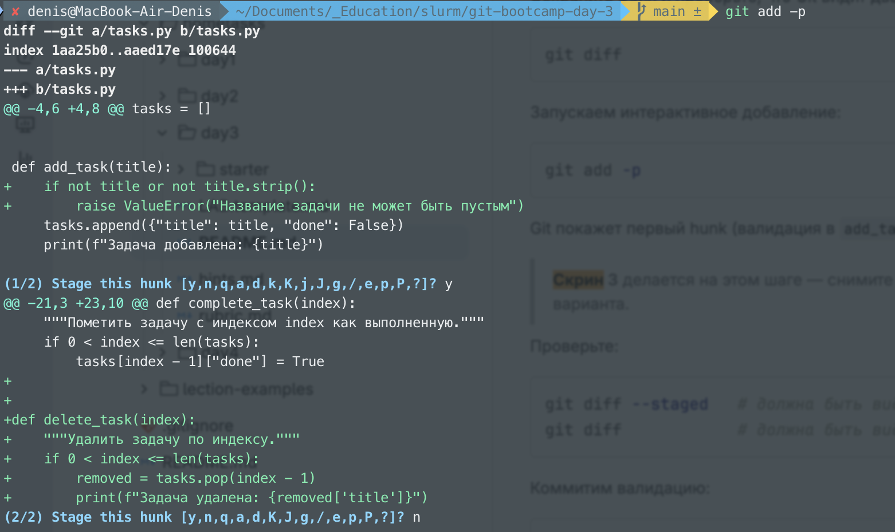
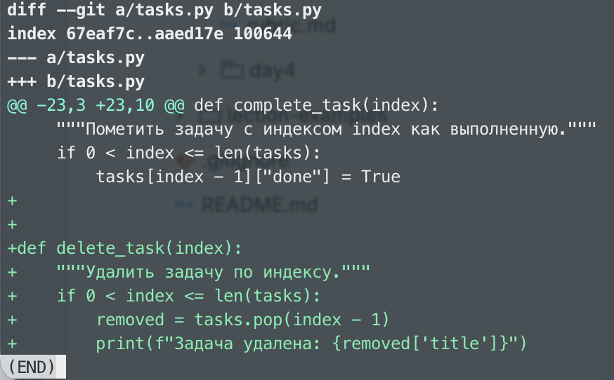
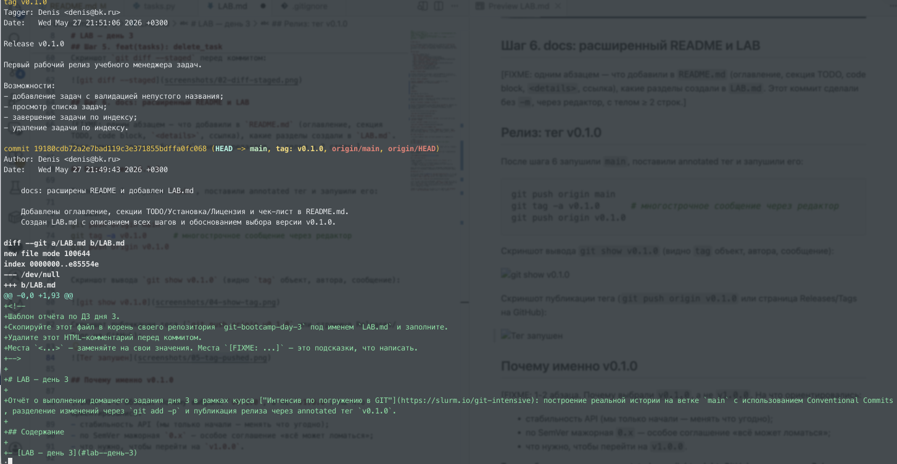
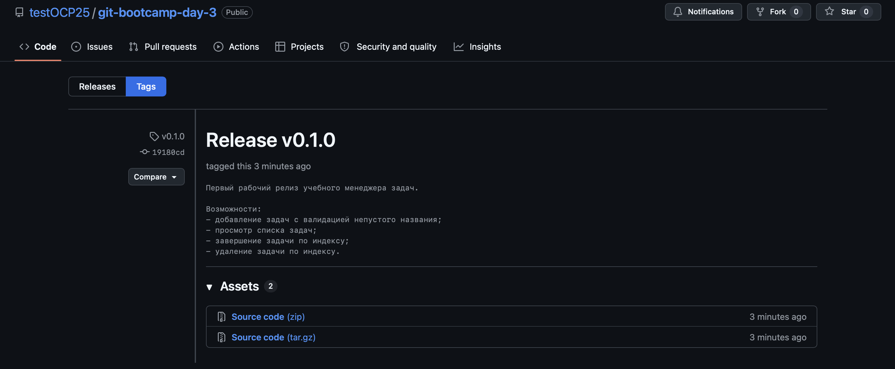
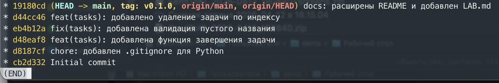

<!--
Шаблон отчёта по ДЗ дня 3.
Скопируйте этот файл в корень своего репозитория `git-bootcamp-day-3` под именем `LAB.md` и заполните.
Удалите этот HTML-комментарий перед коммитом.
Места `<...>` — заменяйте на свои значения. Места `[FIXME: ...]` — это подсказки, что написать.
-->

# LAB — день 3

Отчёт о выполнении домашнего задания дня 3 в рамках курса ["Интенсив по погружению в GIT"](https://slurm.io/git-intensive): построение реальной истории на ветке `main` с использованием Conventional Commits, разделение изменений через `git add -p` и публикация релиза через annotated тег `v0.1.0`.

## Содержание

- [LAB — день 3](#lab--день-3)
  - [Содержание](#содержание)
  - [Шаг 1. Initial commit](#шаг-1-initial-commit)
  - [Шаг 2. chore: .gitignore](#шаг-2-chore-gitignore)
  - [Шаг 3. feat(tasks): complete\_task](#шаг-3-feattasks-complete_task)
  - [Шаг 4. fix(tasks): валидация через add -p](#шаг-4-fixtasks-валидация-через-add--p)
  - [Шаг 5. feat(tasks): delete\_task](#шаг-5-feattasks-delete_task)
  - [Шаг 6. docs: расширенный README и LAB](#шаг-6-docs-расширенный-readme-и-lab)
  - [Релиз: тег v0.1.0](#релиз-тег-v010)
  - [Почему именно v0.1.0](#почему-именно-v010)
  - [Финальная история](#финальная-история)

## Шаг 1. Initial commit

В Initial commit положил два файла - tasks.py README.mdю Комментарий к коммиту был оставлен в таком виде, именно потому что это начальный коммит. Остальные коммиты образуются с учетом Conventional Commits.

## Шаг 2. chore: .gitignore

Добавлен `.gitignore` с Python стэком со следуюшими строками:
<details><summary>Листинг .gitignore</summary>

```text
__pycache__/
*.pyc
.venv/
```
</details>

Файл написано самостоятельно.

## Шаг 3. feat(tasks): complete_task

tasks.py был изменен -- добавлена новыая функция complete_task, feature, scope tasks, потому что скрипт tasks.py.

## Шаг 4. fix(tasks): валидация через add -p

Два не связанных изменения в одном файле. Через `git add -p` разделили два изменения - в add_task и добавление новой delete_task. Первый hunk - изменения в add_task, а второй - добавление новой функции, коммиты соответствующие.

Скриншот интерактивной сессии `git add -p`:



## Шаг 5. feat(tasks): delete_task

Оставшийся hunk закоммитили обычным `git add`. Перед коммитом проверили `git diff --staged`.

Скриншот `git diff --staged` перед коммитом:



## Шаг 6. docs: расширенный README и LAB

[FIXME: одним абзацем — что добавили в `README.md` (оглавление, секция TODO, code block, `<details>`, ссылка), какие разделы создали в `LAB.md`. Этот коммит сделали без `-m`, через редактор, с телом ≥ 2 строк.]

## Релиз: тег v0.1.0

После шага 6 запушили `main`, поставили annotated тег и запушили его:

```bash
git push origin main
git tag -a v0.1.0      # многострочное сообщение через редактор
git push origin v0.1.0
```

Скриншот вывода `git show v0.1.0` (видно `tag` объект, автора, сообщение):



Скриншот публикации тега (`git push origin v0.1.0` или страница Releases/Tags на GitHub):



## Почему именно v0.1.0

Выбрал `v0.1.0`, а не `v1.0.0`, потому что это предварительный релиз с частичной функциональностью. На что ориентировались:
- стабильность API (мы только начали — менять что угодно);
- по SemVer мажорная `0.x` — особое соглашение «всё может ломаться»;
- чтобы перейти на `v1.0.0`, нужно доработать функиинал, провести тестирование

Также объясните, почему annotated, а не lightweight: GitHub показывает в Releases только annotated, в annotated есть автор/дата/сообщение релиза. А Lightweight в контексте Git — это тип тега, который представляет собой простой указатель на конкретный коммит без дополнительных метаданных. Такой тег можно сравнить с «закладкой» или «указателем» на определённый момент в истории репозитория. В нашем случае нужны метаданные.

## Финальная история

Скриншот ниже сделан **сразу после `git push origin v0.1.0`**, до того как был добавлен этот же `LAB.md` со скриншотами. На нём видно 6 коммитов; на последнем — `HEAD -> main, tag: v0.1.0` (тег и HEAD на одном коммите):



После того как я закоммитил актуализацию `LAB.md` со ссылками на скрины 1/4/5, в репозитории появился 7-й коммит. Теперь `HEAD -> main` указывает на него, а тег `v0.1.0` остался на 6-м коммите — на том же, где и был в момент релиза. Тег не двигается за веткой — это и есть его свойство, которое отличает его от ветки.

Вывод и сравнение хешей:
```bash
# git rev-parse v0.1.0
e5f1b22bbfde5aa86c7e34a7a4291dfd3b51b06e
# git rev-parse HEAD
632c1f1d87a23ea493d8e11fb50e86646507a962
```

